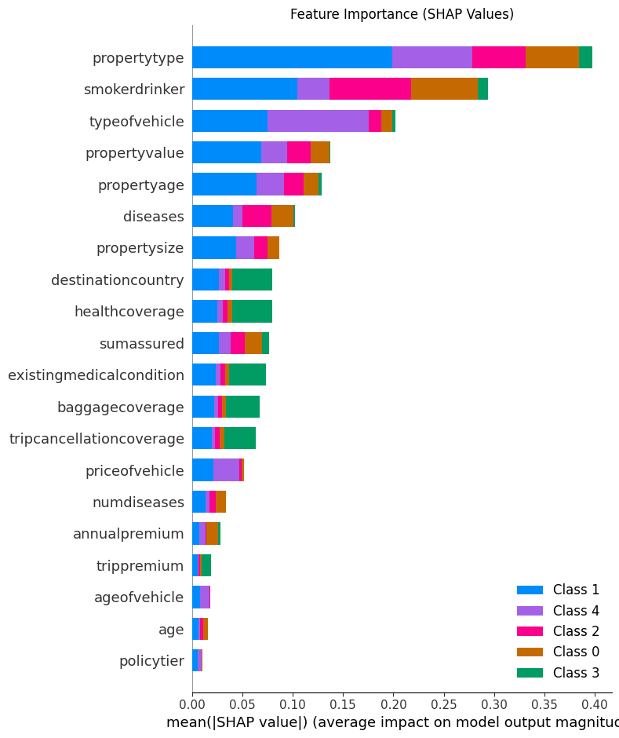
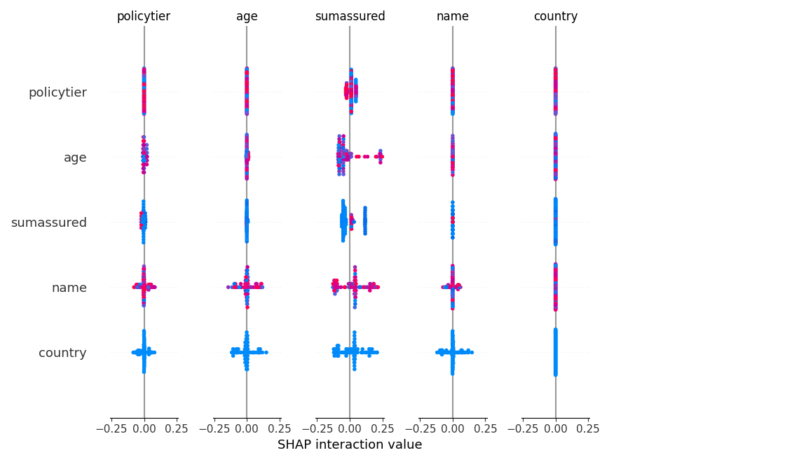

# 🤖 MUFG Shield - AI-Powered Insurance Recommendation System  

##  Overview  
Guard Bot is an intelligent recommendation system that helps users find the most suitable insurance policies based on their profile and requirements. The system supports multiple insurance types across different countries, leveraging machine learning and natural language processing to provide personalized recommendations with clear explanation. 
It uses a hybrid approach (ML + rule-based) so it stays smart, simple, and works on any kind of data.
And it’s not just a bot — it’s an intelligent, responsible and self-explanatory assistant that makes insurance easy to understand.

---

## 🎥 Final Project Demo Video  

https://github.com/user-attachments/assets/ba9e6967-8dff-4809-8c7b-512180234a7d

## 📄Final Project PPT

https://www.canva.com/design/DAGwnYX-Tq8/dV4hMY3JoScgAp563h85KA/edit?utm_content=DAGwnYX-Tq8&utm_campaign=designshare&utm_medium=link2&utm_source=sharebutton

##  Features <a name="features"></a>  

### Multi-Country Support  
- **India & Australia Coverage**  
- Region-specific policy recommendations  
- Currency and regulation compliance  

### Insurance Types  
- 🏥 Health Insurance  
- 💖 Life Insurance  
- ✈️ Travel Insurance  
- 🏠 House Insurance  
- 🚗 Vehicle Insurance  

### AI-Powered Features  
- **Smart Recommendations**: ML models trained on extensive insurance data  
- **Natural Language Processing**: Advanced chat interface using LangChain  
- **Real-time Premium Calculation**: Instant cost estimates  
- **Policy Explanation**: AI-generated simple explanations of complex terms
  
- **Graph RAG Integration**:  
  - Retrieves knowledge from **40 PDFs** and **2 CSVs (10,000×25 rows each)**  
  - Data divided between India & Australia, aligned with **IRDAI & APRA regulations**  
  - Finds **relationships between user profiles, policies, and regulations**  
  - Ensures contextual and regulation-compliant recommendations  

---

##  Technology Stack <a name="technology-stack"></a>  

### Backend (FastAPI)  
- **Python + FastAPI**: High-performance API backend  
- **scikit-learn**: ML model training and inference  
- **LangChain**: Natural language processing and explanations  
- **ChromaDB**: Vector storage for RAG capabilities  
- **Neo4j**: Knowledge Graph for Graph RAG queries  
- **Pydantic**: Data validation and settings management  

### Frontend (React)  
- **React**: Modern UI framework  
- **Material-UI**: Component library  
- **React Router**: Navigation and routing  
- **Axios**: API integration  

---

##  Architecture <a name="architecture"></a>  


## Dataset
https://drive.google.com/drive/folders/1-j18M_fTbyKM5-6jziycuqmet79JUO-E?usp=sharing - – dive into the raw data!

* **Synthetic Data** generated using **current trends + IRDAI (India) & APRA (Australia) regulations**
* **40 PDFs** → Insurance regulatory documents, clauses, and market reports
* **2 CSVs** → \~**10,000×25 rows each**, split between India & Australia
* Used for **model training, Graph RAG retrieval, and PowerBI dashboards**


https://github.com/user-attachments/assets/02b9e85e-41c1-46da-a7ce-79a2e3fce182


---

## Scalability

* **Hybrid Architecture** → combines **ML-based predictive modeling** with **rule-based decision checks** for compliance and interpretability
* **Graph RAG with Neo4j** → scales to **millions of relationships**
* **Dockerized Deployment** → scalable across cloud 

---

## Neo4j + Graph RAG

* **Neo4j Graph Database** stores:

  * Policies, premiums, diseases, coverage, add-ons, exclusions, regulations

* **Graph RAG workflow**:

  * CSV/PDF embeddings → stored in ChromaDB
  * Linked into Neo4j graph relationships
  * Queries combine retrieved embeddings + graph reasoning
  * LLM uses this structured context to produce **explainable recommendations**

## Explainability Demo

Our system includes an interactive explainability demo to help users understand how AI model decisions are made:

- **Decision Tree Visualization**: See how the model arrives at recommendations step-by-step.
- **Feature Importance Analysis**: Discover which features most influence the model's output.
- **SHAP Visualizations**: 
  - 
  - 

Explore the `explainability_demo` folder for a Jupyter notebook and sample decision tree snippets. These visualizations provide transparency and build trust in the system's recommendations.

## UI Screenshots
### Landing Page 


### Country Selection  


### Insurance Type Selection 


### Recommendations Page


## Setup and Installation
### Prerequisites
• Docker and Docker Compose
• Git

### Quick Start
Clone the repository:
```bash
git clone <https://github.com/DrishttiNarwal/MUFG-Hackathon>
```
Start with Docker Compose:
```bash
docker-compose up --build
```

### Manual Setup (Development)
#### Backend Setup
```bash
python -m venv venv
source venv/bin/activate  # Linux/Mac
.\\venv\\Scripts\\activate  # Windows
pip install -r requirements.txt
uvicorn app:app --reload --port 8000
```
#### Frontend Setup
```bash
cd mufg-insurance-frontend
npm install
npm start
```
Access the application:
• Frontend: [http://localhost:80](http://localhost/)
• Backend API: [http://localhost:8000](http://localhost:8000/)
• API Docs: [http://localhost:8000/docs](http://localhost:8000/docs)

## Usage Guide
1. Select Country: Choose between India and Australia
2. Choose Insurance Type: Select from Health, Life, Travel, House, or Vehicle insurance
3. Fill Details: Provide required information
4. Get Recommendations: Receive AI-powered insurance suggestions

## API Documentation
### POST /recommend
Get insurance policy recommendations with explanations
Request Body:
```json
{
  "country": "india|australia",
  "policy": "health|life|travel|house|vehicle",
  "data": {
      // User profile and requirements data
  }
}
```
Response:
```json
{
  "country": "string",
  "policy": "string",
  "recommendation": { },
  "explanations": { }
}
```

## Project Structure
```
├── app.py                 # FastAPI application
├── requirements.txt       # Python dependencies
├── artifacts/             # ML model artifacts
│   ├── india_*/           # India models
│   └── australia_*/       # Australia models
├── scripts/
│   ├── api/               # API utilities
│   ├── llm/               # LLM integration
│   ├── preprocessing/     # Data preprocessing
│   ├── rag/               # RAG implementation
│   └── recommendation/    # ML prediction logic
├── mufg-insurance-frontend/
│   ├── src/               # React source code
│   └── public/            # Static assets
└── vectorstore/           # ChromaDB storage
```

## Use Cases
• Personalized Policy Recommendations: ML + Graph RAG based
• Explainable AI: Transparent decision-making
• Regulation-Aware Analytics: IRDAI & APRA compliance
• Dataset Visualization: PowerBI dashboards for business teams
• Responsible AI: Considered Responsible AI features to mitigate bias

## 📄 License
This project is licensed under the MIT License - see the [LICENSE](LICENSE) file for details.

Made with ❤️ by Team Insurance Bot


